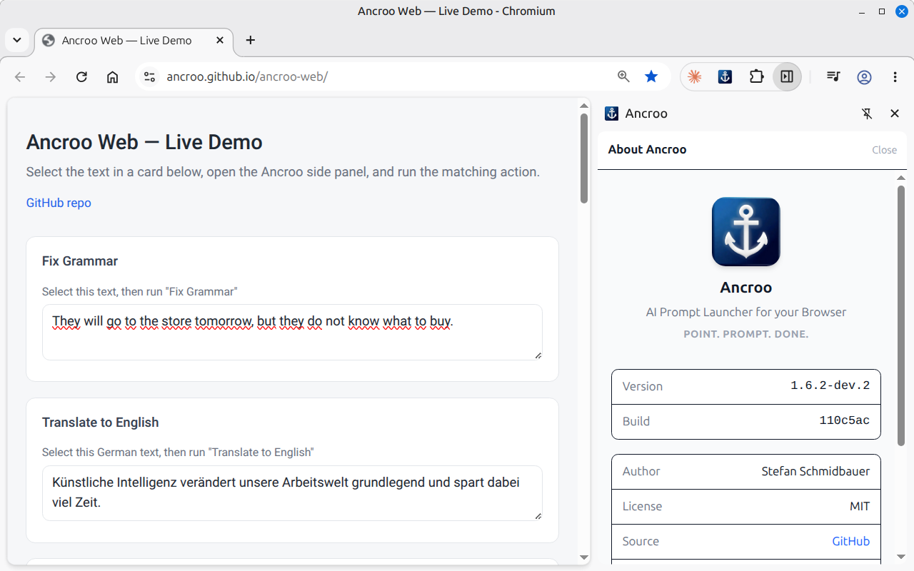
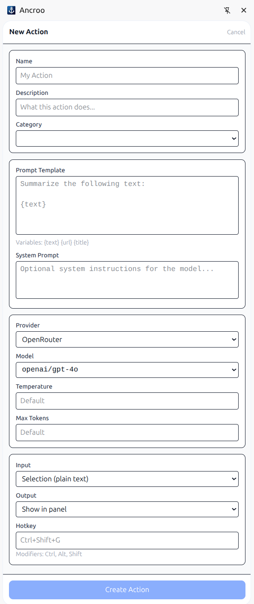

#  Ancroo Web

[](LICENSE)
[](https://www.typescriptlang.org/)
[](https://preactjs.com/)
[](https://vite.dev/)
[](https://tailwindcss.com/)
[](https://pnpm.io/)
[](https://developer.chrome.com/docs/extensions/)
[](https://ancroo.github.io/ancroo-web/)
[](https://www.youtube.com/watch?v=2czqRFo1qpU)
[](https://www.youtube.com/watch?v=ZObrvL4vdXo)

**Point. Prompt. Done.**

AI Prompt Launcher for your Browser. Point at anything on a page, run an AI prompt, get results — without leaving the tab.

Manifest V3 browser extension built with Preact and TypeScript. Calls LLM providers directly — no server or account needed.



> 📺 **See Ancroo in action:** watch the [overview video](https://www.youtube.com/watch?v=2czqRFo1qpU) for a quick tour of how it works.

## Features

- **Side panel UI** — browse and trigger actions from a side panel (`Alt+Shift+Y` or click the extension icon)
- **Flexible input** — pick one input per action: Selection (formatted), Selection (plain text), Whole page, or Manual entry. Whatever you choose feeds the `{text}` variable in your prompt; `{url}` and `{title}` are always available too
- **Hotkeys** — keyboard shortcuts trigger actions instantly from any page
- **Output actions** — results can replace selected text, copy to clipboard, insert before/after, or show in panel
- **Follow-up messages** — after a manual-entry action returns a result, send another message directly from the result view to iterate without navigating back
- **Execution history** — last 50 results are stored locally for quick access and re-use
- **Multiple LLM providers** — OpenAI, Anthropic, Google Gemini, Ollama (local), OpenRouter, or any OpenAI-compatible endpoint
- **Starter actions** — eleven ready-to-use actions (Summarize, Translate to English, Rewrite Formal, Explain, Fix Grammar, Fix Capitalization, Draft Reply, Polite Decline, Thank-You Note, Convert to Markdown, Ask AI) are created automatically
- **Action categories** — organise actions into named categories (Starter, Writing, Coding, …) with icons; collapsible groups in the side panel
- **Action editor** — create and manage actions with custom templates, model selection, system prompt, temperature, max tokens, hotkey, and category assignment
- **Model browser** — auto-detects available models from your provider
- **Backup & restore** — export all actions, categories, and provider settings to a JSON file; import them on any device or after reinstalling
- **No server required** — everything runs in the browser extension



## Install

> 📺 **New to Ancroo?** The [setup walkthrough](https://www.youtube.com/watch?v=ZObrvL4vdXo) covers installing the extension and connecting your first LLM provider.

### Chrome Web Store (recommended)

[**Install Ancroo from the Chrome Web Store**](https://chromewebstore.google.com/detail/ancroo/jeaaomlligaaoohplachpimjgopjmfim)

### Manual install (developers)

Every push to `main` automatically builds the extension via GitHub Actions:

1. Open [Actions](https://github.com/ancroo/ancroo-web/actions/workflows/build.yml)
2. Click the latest successful run
3. Download the **ancroo-web-extension** artifact and unzip it

Or build locally:

```bash
pnpm install && pnpm build
# or: ./build.sh   (auto-installs pnpm via corepack if missing)
```

Then load in Chrome:

1. Open `chrome://extensions`
2. Enable **Developer mode**
3. Click **Load unpacked** → select the `dist/` folder

## Development

```bash
pnpm dev
```

### Tests

Unit tests cover the LLM request path end to end — that an action's
`temperature`, `max_tokens` and system prompt survive the trip from the editor
form through storage to each provider's API in the shape it expects, including
the falsy `temperature: 0`.

```bash
pnpm test          # single run
pnpm test:watch    # watch mode
```

### Inspecting real requests

`tools/echo-llm-server.mjs` is a local fake LLM server that speaks all four
supported API dialects. It logs every request body and echoes the received
parameters back as the model reply, so they show up directly in the side panel
— useful for verifying end to end what the extension puts on the wire, without
spending API credits.

```bash
node tools/echo-llm-server.mjs        # listens on http://localhost:8899
```

Then add a provider in Settings (any non-empty API key):

| Provider type     | Base URL                       |
| ----------------- | ------------------------------ |
| OpenAI-compatible | `http://localhost:8899/v1`     |
| Ollama            | `http://localhost:8899`        |
| Anthropic         | `http://localhost:8899`        |
| Gemini            | `http://localhost:8899/v1beta` |

Press **Test** or **Save** on the provider afterwards — that is where the host
permission for `localhost:8899` is granted.

## Project Structure

```
src/
├── background/    # Service worker (hotkeys, side panel lifecycle)
├── content/       # Content script (text selection, insertion)
├── shared/        # Types, settings, LLM adapters, messages
│   └── llm/       # LLM provider adapters (OpenAI, Anthropic, Gemini, Ollama)
├── sidepanel/     # Side panel UI (Preact)
└── test/          # Test setup (extension API stubs)

tools/             # Dev tooling (local fake LLM server)
```

## Contributing

Contributions are welcome! Feel free to open an [issue](https://github.com/ancroo/ancroo-web/issues) or submit a pull request.

## Privacy

See [Privacy Policy](PRIVACY_POLICY.md) — Ancroo collects no data. All settings, API keys, and history stay in your browser. Data is only sent to LLM providers you configure.

## Security

**API Keys:** API keys are stored in `chrome.storage.local`, which is sandboxed per extension and not accessible by websites or other extensions. Keys are only sent to the configured LLM provider. Note that the storage is not encrypted on disk — anyone with access to your browser profile can read them. This is standard practice for browser extensions.

To report a security vulnerability, please use [GitHub's private vulnerability reporting](https://github.com/ancroo/ancroo-web/security/advisories/new) instead of opening a public issue.

## Acknowledgments

This project is built with the following open-source software:

| Project                                       | Purpose                            | License    |
| --------------------------------------------- | ---------------------------------- | ---------- |
| [Preact](https://preactjs.com/)               | UI framework                       | MIT        |
| [Vite](https://vite.dev/)                     | Build tool                         | MIT        |
| [CRXJS](https://crxjs.dev/vite-plugin/)       | Vite plugin for browser extensions | MIT        |
| [Tailwind CSS](https://tailwindcss.com/)      | CSS framework                      | MIT        |
| [TypeScript](https://www.typescriptlang.org/) | Language                           | Apache-2.0 |

## License

MIT — see [LICENSE](LICENSE). The Ancroo name is not covered by this license and remains the property of the author.

## Author

**Stefan Schmidbauer** — [GitHub](https://github.com/Stefan-Schmidbauer) · [stefan@ancroo.com](mailto:stefan@ancroo.com)

---

Built with the help of AI ([Claude](https://claude.ai) by Anthropic).
